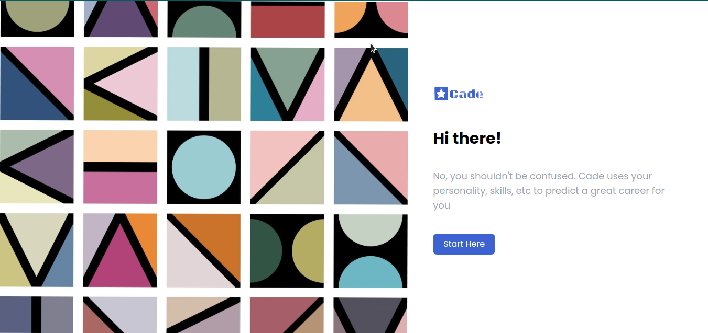

# Cade


I worked on the UI design. I also added some more features to the web app

[](https://github.com/maryojo/cade/commits/main)

- **Live Site URL** : [https://cade2.herokuapp.com/](https://cade2.herokuapp.com/)
- **GitHub Repository** : [https://github.com/maryojo/cade](https://github.com/maryojo/cade)


### Progress


## Table of contents

- [](#)
    - [Progress](#progress)
  - [Table of contents](#table-of-contents)
  - [Overview](#overview)
    - [The challenge](#the-challenge)
    - [Screenshot](#screenshot)
    - [Features](#features)
  - [My process](#my-process)
    - [Built with](#built-with)
    - [What I learned](#what-i-learned)
    - [Continued development](#continued-development)
    - [Useful resources](#useful-resources)
  - [Author](#author)


## Overview

### The challenge

Create the UI design and the website should operate as required: 
- View the optimal layout for each of the website's pages depending on their device's screen size
- See hover states for all interactive elements on the page
- View each page and be able to toggle between the tabs to see new information

### Screenshot


### Features

- Space Launches Updates


## My process

### Built with

[](https://reactjs.org/)  [](https://tailwindcss.com/)

API: [Space](#)

### What I learned

```html
<h1>Some HTML code I'm proud of</h1>
```
```css
.proud-of-this-css {
  color: papayawhip;
}
```
```js
const proudOfThisFunc = () => {
  console.log('🎉')
}
```

### Continued development
- axios


### Useful resources

- [Personalizer API documentation](https://www.npmjs.com/package/react-tabs) - This helped me easily create tabs. I'd recommend it to anyone still learning this concept.

- [Personalizer npm doc](https://www.example.com) - This is an amazing article that helped me finally understand. 

- [Personalizer tutorials](https://www.example.com) - This is an amazing article that helped me finally understand. 

- [Surveyjs doc](https://www.example.com) - This is an amazing article that helped me finally understand. 

- [My React-AzureVision demo article](https://www.example.com) - This is an amazing article that helped me finally understand. 


## Author

- Website - [Mary Ojo](https://www.maryojo.me)
