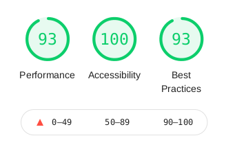

# Cade
Cade is a career recommendation system made primarily for High School students. It makes use of Reinforcement Learning through the Azure Personalizer to make predictions. The input data for the system is the user's academic result and personality type(which is determined through a test). The user gets a career path prediction and some information about it. The user then gives a feedback. I originally made the first version [here](http://cadepersonalizer.herokuapp.com/), but made some major updates on the technologies used and the overall operation and usability of the app was done.

- **Live Site URL** : [https://cade2.herokuapp.com/](https://cade2.herokuapp.com/)
- **GitHub Repository** : [https://github.com/maryojo/cade](https://github.com/maryojo/cade)

### Progress

## Table of contents

- 
    <!-- - [Progress](#progress) -->
  - [Table of contents](#table-of-contents)
  - [Overview](#overview)
    <!-- - [Screenshot](#screenshot) -->
    - [Features](#features)
    - [Built with](#built-with)
    - [The process](#the-process)
    - [What I learned](#what-i-learned)
    - [Continued learning](#continued-learning)
    - [Performance](#performance)
    - [Continued development](#continued-development)
    - [Useful resources](#useful-resources)
  - [Author](#author)

## Overview

<!-- ### Screenshot

 -->

### Features

- Career path prediction
- Career description

### Built with

    

### The process
I created the app by firstly identifying the major functions and parts of the app. The major parts of the app were the input components, processing data and handling the output. To get input from the user, I made use of Surveyjs which simplified the data collection process. I integrated Azure Personalizer into the app to process the results. Wikimedia API was used to give more details about each prediction. The system feedback is gotten through the user's direct response.

### What I learned
- Styling the Surveyjs forms was a bit challenging because of the nature of the library and the use of TailwindCSS on my own application. But I eventually found a way to do it.
- I learned a lot particularly about the integration of Azure Cognitive Services in client-side applications

### Continued learning
- Reward API

### Performance
I made use of Google Lighthouse to test the application. The first report I got showed that the app had great Accessibility and Best practices scores of 94% and 100% respectively, but needed improvement on the Performance which had a score of 47%. This was caused by slow image loading. To  improve the app performance, I made use of a CDN for the images, reduced image size and I also added a 'preconnect' link to the CDN. This greatly improved the performance to 93%. Based on my personal observations, the color contrast for a text area was not good. I made the text darker and this increased the accessibility to 100%.

### Continued development
- Better image quality for personality test
- Addition of sentiment analysis as a form of rewarding the system
- Personal accounts
- Downloading/sharing/saving results

### Useful resources

- [Personalizer Introduction](https://docs.microsoft.com/en-us/azure/cognitive-services/personalizer/what-is-personalizer)

- [Personalizer Rank API doc](https://westus2.dev.cognitive.microsoft.com/docs/services/personalizer-api/operations/Rank)

- [Personalizer npm doc](https://www.npmjs.com/package/@azure/cognitiveservices-personalizer/v/1.0.0)

- [Personalizer tutorial](https://docs.microsoft.com/en-us/azure/cognitive-services/personalizer/tutorial-use-personalizer-web-app) - This article described how a .NET app using the Azure Personalizer was built. 

- [Surveyjs doc](https://surveyjs.io/Documentation/Library) - This is helped me understand integration of Surveyjs

- [My React-AzureVision demo article](https://maryojo.hashnode.dev/create-an-image-analysis-app-using-azure-computer-vision-with-react-app#heading-step-1-create-and-setup-react-app-then-install-dependencies)

## Author

- Website - [Mary Ojo](https://www.maryojo.me)
